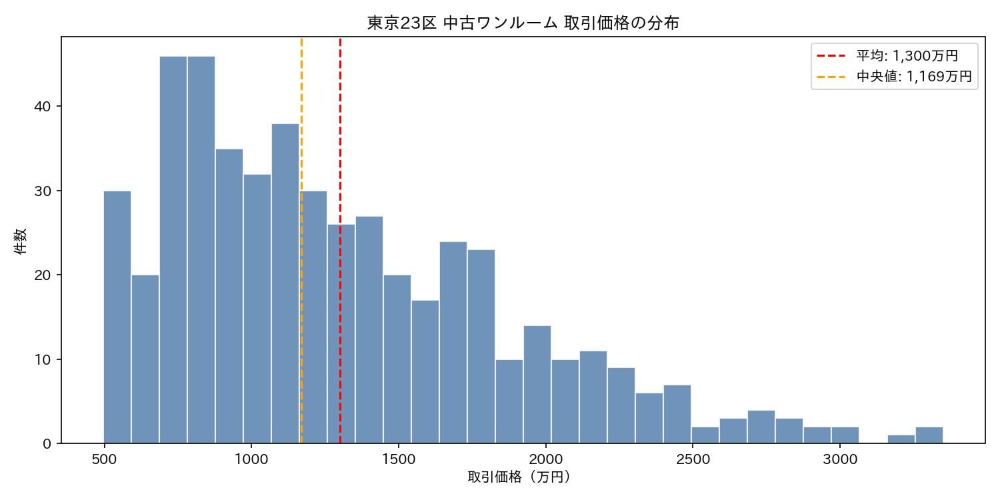
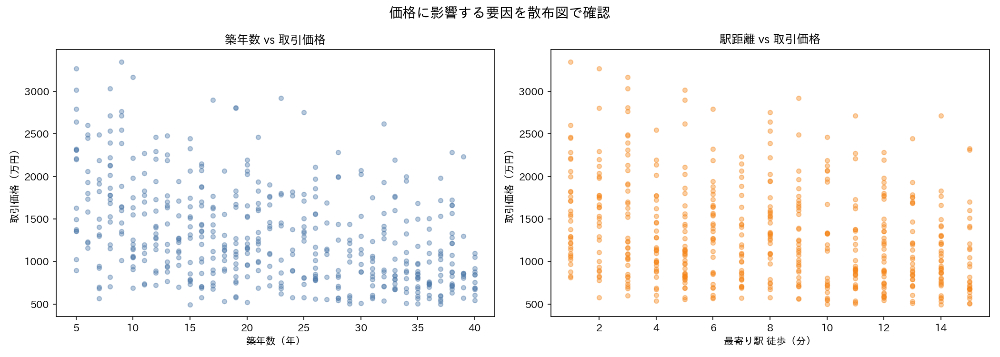
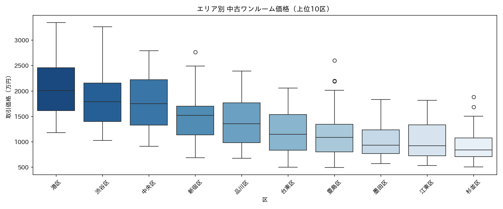
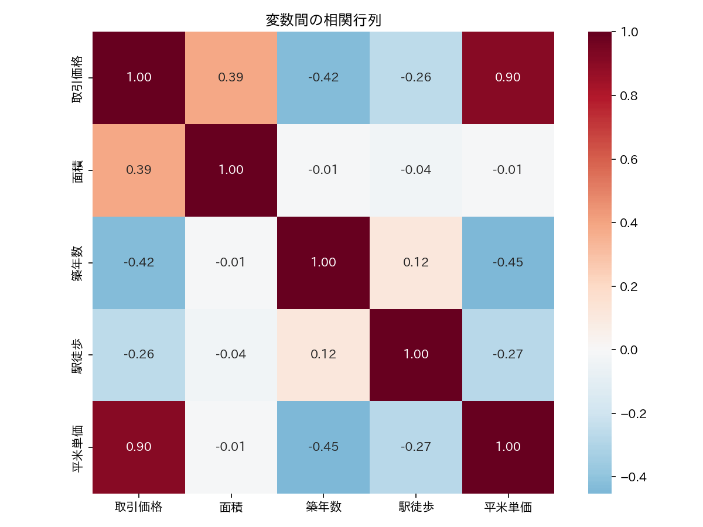

# Pythonで学ぶ<br>不動産データ分析

## Part 1: 探索的データ分析

飛騨高山Pythonの会 2026年4月

---

## 今日のアジェンダ

1. シリーズ概要
2. データの入手方法
3. 記述統計 — 数字で全体像をつかむ
4. 可視化 — 目でパターンを見つける
5. まとめと次回予告

---

## このシリーズについて

全3回で **Python × 統計 × AI** を学ぶ

| 回 | テーマ | 統計トピック |
|---|---|---|
| **① 4月** | **探索的データ分析** | **記述統計・可視化** |
| ② 5月 | 回帰分析 | 単回帰・重回帰・p値 |
| ③ 6月 | 機械学習 | ランダムフォレスト |

題材: **東京23区 中古ワンルームマンション**

---

## なぜ不動産 × データ分析？

--

### 発表者の個人的な動機

- 実は私、不動産投資をしています
- でも正直、物件選びは **「勘」と「営業トーク」頼み**
- 統計はほぼ初心者 — 数字で語れるようになりたい

→ せっかくなので勉強過程を勉強会のネタにしました

--

### なぜこの題材がPython学習に向くか

- **公開API** があり誰でも同じデータで試せる（国交省）
- 価格・面積・築年数など **数値と categorical が混在**
- pandas / matplotlib / seaborn の練習にちょうどいい粒度
- 不動産に興味がなくても **EDAの型** は他分野に応用できる

--

### データで答えたい問い（発表者の関心）

- このエリアの **相場** はいくら？
- 築年数で価格は **どれくらい下がる**？
- 本当に **割安** な物件はどれ？

→ 今日はその第一歩「データを見る力」を身につけます

---

## データの入手

--

### 不動産情報ライブラリ（国交省）

https://www.reinfolib.mlit.go.jp/

- 国土交通省が提供する **オープンデータ**
- 実際の不動産取引価格情報を収録
- **API** でプログラムから取得可能（無料・要申請）

--

### API の使い方

```python
import requests

API_URL = "https://www.reinfolib.mlit.go.jp/ex-api/external/XIT001"

resp = requests.get(API_URL, headers={
    "Ocp-Apim-Subscription-Key": "YOUR_API_KEY"
}, params={
    "year": "2025",
    "quarter": "1",
    "area": "13",       # 東京都
})

data = resp.json()
```

--

### ⚠ 今回は API キーが間に合いませんでした

- 申請済みだが **発行待ち**（約5営業日かかる）
- なので今日は **API をモック** してデモします
- `unittest.mock` で `requests.get` を差し替え
- レスポンスは本物の仕様に合わせた **サンプルデータ（500件）**

→ キーが届いたら同じコードが本番 API にそのまま通る設計

--

### 今日使うデータ

API レスポンスと同じ形式のサンプルデータ（500件）

| カラム | 内容 |
|-------|------|
| TradePrice | 取引価格（円） |
| Area | 面積（㎡） |
| BuildingYear | 建築年 |
| Municipality | 市区町村 |
| NearestStation | 最寄り駅 |
| TimeToNearestStation | 駅徒歩（分） |

--

### コード解説① モックへの差し替え

```python
from unittest.mock import patch

def main():
    if USE_MOCK:
        ctx = patch("requests.get", side_effect=_mock_api_response)
    else:
        ctx = nullcontext()

    with ctx:
        df = fetch_transactions(2025, 1)
```

- `patch("requests.get", ...)` で **関数自体を差し替え**
- `side_effect` に関数を渡すと、呼び出しごとに **引数を受け取って動的にレスポンス生成**
- `with` を抜けると元に戻る → 本番コードに副作用なし

--

### コード解説② 本物そっくりのレスポンス

```python
def _mock_api_response(*args, **kwargs):
    params = kwargs.get("params", {})
    target = f"{params['year']}年第{params['quarter']}四半期"
    records = [r for r in _load_sample_records()
               if r["Period"] == target]

    mock_resp = MagicMock(spec=requests.Response)
    mock_resp.status_code = 200
    mock_resp.json.return_value = {"status": "OK", "data": records}
    mock_resp.raise_for_status.return_value = None
    return mock_resp
```

- `spec=requests.Response` で **本物の Response と同じ属性** しか許可しない
  → typo で `mock_resp.jsno()` のような事故を防げる
- `params` を読んで **クエリに応じたデータを返す** = API の挙動を再現

--

### コード解説③ モック／本番の切り替え

```python
API_KEY = os.environ.get("REINFOLIB_API_KEY", "")
USE_MOCK = not API_KEY
```

- 環境変数があれば本番、なければモック
- **`fetch_transactions` 自体は 1 行も変わらない**
- キーが届いたら `export REINFOLIB_API_KEY=...` するだけ

→ **テスト容易性** と **本番コードの単純さ** を両立するパターン

--

### なぜ mock を使うのか

| もし mock を使わなかったら | mock を使うと |
|---|---|
| キー待ちで開発が止まる | **今日から書ける** |
| テスト実行に外部 API が必要 | **オフラインで完結** |
| API の障害でテストが落ちる | **安定した CI** |
| 課金・レート制限の心配 | **無料・無制限** |

外部 API を叩くコードを書くときの **定石** として覚えておきたい

---

## 記述統計

数字で全体像をつかむ

--

### pandas の describe() が最強

```python
import pandas as pd

df = pd.read_csv("tokyo_mansion.csv")
df["BuildingAge"] = 2025 - df["BuildingYear"].str.replace("年", "").astype(int)
df["PriceMan"] = df["TradePrice"] / 10000

df[["PriceMan", "Area", "BuildingAge"]].describe()
```

```
          PriceMan   Area  BuildingAge
count      500.0   500.0      500.0
mean      1299.7    23.1       22.0   ← 平均
std        576.4     4.1       10.5   ← 標準偏差
min        495.5    16.0        5.0
25%        841.6    19.4       13.0
50%       1168.7    22.9       21.0   ← 中央値
75%       1658.7    26.7       32.0
max       3349.8    30.0       40.0
```

--

### コード解説① 派生カラムの作り方

```python
df["BuildingAge"] = 2025 - df["BuildingYear"].str.replace("年", "").astype(int)
df["PriceMan"]    = df["TradePrice"] / 10000
```

- **`df["新しい名前"] = ...`** で列を追加（破壊的）
- `BuildingYear` は `"1995年"` のような **文字列** で入っている
  → `.str.replace("年", "")` で年を除去 → `.astype(int)` で数値化
- pandas の **ベクトル化演算**: `2025 - Series` が全行に一括適用（for ループ不要）
- `TradePrice / 10000` で 円 → 万円。単位を揃えると **describe の結果が読みやすい**

→ 分析前の **前処理（クレンジング）** が EDA の 8 割

--

### コード解説② describe() の読み方

```python
df[["PriceMan", "Area", "BuildingAge"]].describe()
```

- `df[["列A", "列B"]]` で **複数列を選択**（リストの中にリスト）
- `.describe()` は数値列に対し **8 つの統計量を一発で計算**

| 行 | 意味 | 見るポイント |
|---|---|---|
| count | 件数 | 欠損がないか |
| mean / std | 平均・標準偏差 | バラつきの規模感 |
| min / max | 最小・最大 | 外れ値の気配 |
| 25% / 50% / 75% | 四分位 | **50% が中央値**、箱ひげ図の箱 |

→ 数値列をまとめて選択して describe、が **最初の一手** の定型

--

### 平均 vs 中央値

```
平均:   1,300 万円
中央値: 1,169 万円
差:     +131 万円
```

**平均 > 中央値** → 高額物件に引っ張られている

不動産価格のような **右に歪んだ分布** では
**中央値** のほうが「普通の物件」の実態に近い

--

### コード解説③ mean() と median()

```python
mean_price   = df["PriceMan"].mean()
median_price = df["PriceMan"].median()
print(f"  平均:   {mean_price:,.0f} 万円")
print(f"  差:     {mean_price - median_price:+,.0f} 万円")
```

- `df["列名"]` は **Series**（1 列分の配列）
- Series に `.mean()` / `.median()` / `.std()` など統計メソッドが生えている
- f-string の **フォーマット指定子**:
  - `:,.0f` → 3 桁区切り + 小数点以下 0 桁（例: `1,300`）
  - `:+,.0f` → 符号付き（例: `+131`）

→ **print デバッグの見やすさ** は分析のスピードに直結

--

### 標準偏差 = バラつき = リスク

```
港区:   中央価格 2,011万円  変動係数 30.2%
板橋区: 中央価格   820万円  変動係数 24.9%
中野区: 中央価格   946万円  変動係数 55.4%  ← !?
```

**変動係数**（標準偏差 ÷ 中央値）で比較すると…

- 板橋区: 価格が安定 → リスク低め
- 中野区: 同じ区でも価格差が大きい → 物件選びが重要

--

### コード解説④ groupby で一気に集計

```python
area_std = (
    df.groupby("Municipality")["PriceMan"]
      .agg(["std", "median"])
      .sort_values("std", ascending=False)
)
area_std["変動係数"] = (area_std["std"] / area_std["median"] * 100).round(1)
```

- `groupby("Municipality")` → 市区町村ごとに **グループ分け**
- `["PriceMan"]` で対象列を絞る
- `.agg(["std", "median"])` で **複数の統計量をまとめて計算**
- 結果は「Municipality を index に持つ DataFrame」になる
- 新しい列 `変動係数` は **既存列同士の演算** で作れる（ベクトル化）

→ **SQL で言えば `GROUP BY + 複数集計`** を 1 行で書けるのが pandas の強み

--

### コード解説⑤ なぜ変動係数を使うのか

```python
area_std["変動係数"] = area_std["std"] / area_std["median"] * 100
```

- 標準偏差 **だけ** を見ると高いエリアほど大きく出る
  - 例: 港区の std は板橋区より大きいのは当然（価格の絶対額が違う）
- **標準偏差 ÷ 中央値** で割ると **スケールの影響を消せる**
- → 異なるエリアの **バラつきを公平に比較** できる

これが「**数字を割って無次元化する**」という統計の基本テクニック

---

## 可視化

目でパターンを見つける

--

### 1. ヒストグラム — 分布を見る

```python
import matplotlib.pyplot as plt

plt.hist(df["PriceMan"], bins=30)
plt.axvline(df["PriceMan"].mean(), color="red",
            linestyle="--", label="平均")
plt.axvline(df["PriceMan"].median(), color="orange",
            linestyle="--", label="中央値")
plt.legend()
```

→ 右裾が長い（＝高額物件が少数ある）ことが一目でわかる

--

### ヒストグラムの結果



平均と中央値のズレ = **分布の歪み** が可視化できた

--

### 2. 散布図 — 関係を見る

```python
fig, axes = plt.subplots(1, 2)

axes[0].scatter(df["BuildingAge"], df["PriceMan"])
axes[0].set_xlabel("築年数")

axes[1].scatter(df["TimeToNearestStation"], df["PriceMan"])
axes[1].set_xlabel("駅徒歩（分）")
```

--

### 散布図の結果



- 築年数が増えると価格は **下がる傾向**（左図）
- 駅から遠いと価格は **やや下がる**（右図）

→ 次回の回帰分析で「どれくらい影響するか」を数値化します

--

### 3. 箱ひげ図 — エリアを比較する

```python
import seaborn as sns

sns.boxplot(data=df, x="Municipality", y="PriceMan")
```

--

### 箱ひげ図の結果



- 箱 = 25%〜75% の範囲（物件の半数がここに入る）
- ○ = 外れ値（極端に高い/安い物件）
- 箱の大きさ = バラつき → エリアごとのリスクが見える

--

### 4. 相関行列 — 変数間の関係を俯瞰

```python
corr = df[["PriceMan", "Area", "BuildingAge",
           "TimeToNearestStation"]].corr()
sns.heatmap(corr, annot=True, cmap="RdBu_r")
```

--

### 相関行列の結果



| 相関係数 | 意味 |
|---------|------|
| +1 に近い | 一方が増えるともう一方も増える |
| −1 に近い | 一方が増えるともう一方は減る |
| 0 に近い | 関係が薄い |

築年数 vs 価格 = **-0.42**（築年数が増えると価格は下がる）

---

## 今日のまとめ

--

### 学んだこと

| 概念 | 不動産での意味 |
|------|-------------|
| 中央値 | 「普通の物件」の価格を知る |
| 標準偏差 | エリアのリスク（バラつき）を測る |
| ヒストグラム | 価格帯の分布を把握する |
| 散布図 | 築年数・駅距離と価格の関係を見る |
| 相関行列 | どの要因が価格に効くか俯瞰する |

--

### 使ったツール

```bash
pip install pandas matplotlib seaborn japanize-matplotlib
```

```python
df.describe()          # 記述統計
plt.hist()             # ヒストグラム
plt.scatter()          # 散布図
sns.boxplot()          # 箱ひげ図
sns.heatmap(df.corr()) # 相関行列
```

--

### 次回予告（5月）

## 回帰分析で価格の構造を理解する

- 「築年数が1年増えると価格はいくら下がる？」
- 「駅徒歩1分の価値は何万円？」
- 統計的に「割安な物件」を見つける方法

---

## デモコード・資料

GitHub で公開しています

`demo/2026-04-real-estate-eda/`

```
00_generate_sample_data.py  # サンプルデータ生成
01_fetch_data.py            # API からデータ取得
02_descriptive_stats.py     # 記述統計
03_visualization.py         # 可視化
```

---

# ありがとうございました

質問・フィードバック歓迎です！
