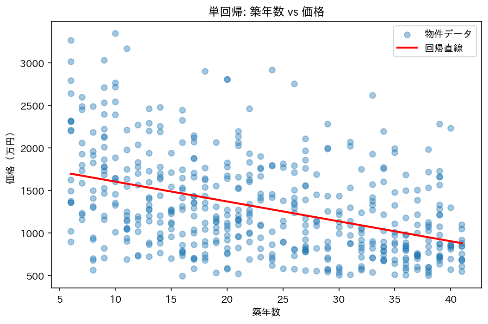
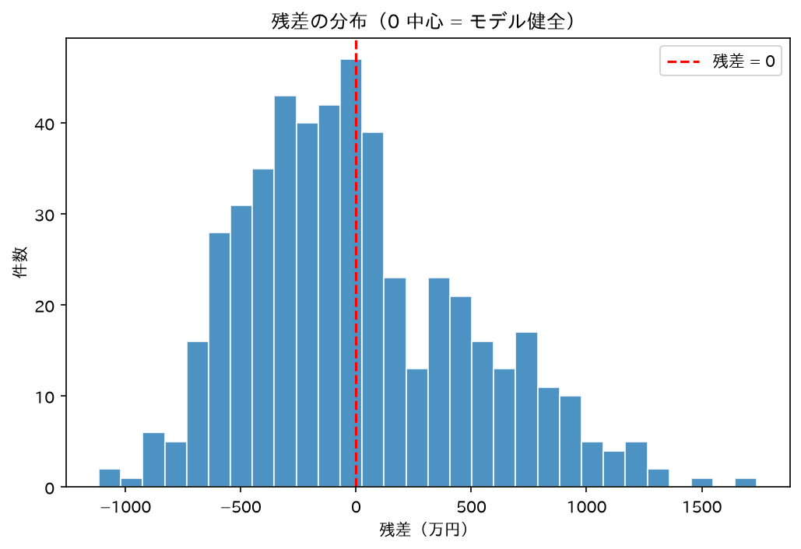

# Pythonで学ぶ<br>不動産データ分析

## Part 2: 回帰分析

飛騨高山Pythonの会 2026年6月

---

## 今日のアジェンダ

1. 前回のおさらい
2. 回帰分析ってなに？
3. 単回帰 — 築年数だけで価格を説明する
4. 重回帰 — 複数の要因で価格を説明する
5. p値 — その要因は本当に効いてる？
6. 割安物件を見つける
7. まとめと次回予告

---

## このシリーズについて

全3回で **Python × 統計 × AI** を学ぶ

| 回 | テーマ | 統計トピック |
|---|---|---|
| ① 4月 | 探索的データ分析 | 記述統計・可視化 |
| **② 6月** | **回帰分析** | **単回帰・重回帰・p値** |
| ③ 7月 | 機械学習 | ランダムフォレスト |

題材: **東京23区 中古ワンルームマンション**

---

## 前回のおさらい

--

### Part 1 でやったこと（モックデータ）

| 何をした？ | 何がわかった？ |
|---|---|
| `describe()` で数字を見た | 中央値 1,169 万円が「普通の物件」 |
| 散布図を描いた | 築年数↑・駅距離↑ → 価格↓ の傾向 |
| 相関行列を見た | 築年数と価格の相関 = −0.42 |

**前回わかったこと**: 築年数や駅距離が価格に関係しそう

> ※ Part 1 は **API キーが間に合わず**、本物の仕様に合わせた
> モックデータ（サンプル500件）で分析していました

--

### 今回から「実データ」！ 🎉

**API キーが届きました**

- Part 1 のコードは **1行も変えず**、鍵を入れるだけで本番APIに接続
- 国土交通省の **実際の取引価格** で分析できるようになった

…が、実データを取ってみたら **想定外** が:

| 前回（モック） | 実データ（本番API） |
|---|---|
| 最寄駅・駅徒歩あり（自作） | **駅の項目が無い！** |
| 中央値 1,169 万円 | 件数も価格も変わる |

→ 予告した「駅徒歩1分の価値」は **出せなくなった**ので、
　 実在する **面積・築年数** で分析を組み直します

**今回やること**: 各要因が **「どれくらい」** 効くのか数字にする

---

## 回帰分析ってなに？

--

### ひとことで言うと

**「データから法則を見つけて、式で表す」** こと

```
価格 = ○○ × 築年数 + △△
```

- この式がわかれば…
  - 築年数 **1年増えると** 価格は **何万円下がる？**
  - 築 30 年の物件は **だいたい何万円？** と予測できる

--

### 散布図にまっすぐな線を引くイメージ

前回描いた散布図を思い出してください

- 点がバラバラに散らばっていた
- でもなんとなく **右下がり** だった
- 回帰分析 = その「なんとなく」を **一本の線** にする

→ 「線より上の点 = 割高」「線より下の点 = 割安」と判断できる

---

## 単回帰分析

築年数 **だけ** で価格を説明する

--

### そもそも「単回帰」って？

- **「単」** = 原因が **1つだけ**
- **「回帰」** = データに線を引くこと

```
価格 = a × 築年数 + b
```

- `a` = **傾き**（築年数 1年あたりの価格変化）
- `b` = **切片**（築年数 0年のときの価格）

この `a` と `b` を **データから自動で求めてくれる** のが回帰分析

--

### 使うライブラリ: statsmodels

```bash
pip install statsmodels
```

- Python で回帰分析するライブラリ
- **p値や信頼区間** が見られるのが特長
- scikit-learn とは役割が違う:

| ライブラリ | 得意なこと |
|---|---|
| statsmodels | 「なぜ？」を分析（係数・p値） |
| scikit-learn | 「いくら？」を予測（機械学習） |

今回は **「なぜ」を知りたい** ので statsmodels を使う

--

### 単回帰のコード

```python
import statsmodels.api as sm

X = df[["BuildingAge"]]
X = sm.add_constant(X)  # 切片を追加
y = df["PriceMan"]

model = sm.OLS(y, X).fit()
print(model.summary())
```

--

### コード解説① OLS ってなに？

```python
model = sm.OLS(y, X).fit()
```

- **OLS** = Ordinary Least Squares（最小二乗法）
- 難しく聞こえるけど、やっていることは単純:
  - すべての点と線の **ズレ（誤差）** を計算する
  - そのズレの **2乗の合計が一番小さくなる** 線を見つける
- `.fit()` = 「計算を実行して」という意味

→ **「一番うまくフィットする線を引いてね」** と頼んでいるだけ

--

### コード解説② add_constant ってなに？

```python
X = sm.add_constant(X)
```

`add_constant` する前:

```
  BuildingAge
0          30
1          15
2          22
```

`add_constant` した後:

```
  const  BuildingAge
0   1.0           30
1   1.0           15
2   1.0           22
```

- **const（定数列）** = 切片 `b` を計算するための「おまじない」
- statsmodels は切片を自動で追加してくれない → 手動で入れる
- 忘れるとおかしな結果になるので注意

--

### summary() の結果（抜粋）

```
                 coef    std err      t      P>|t|
---------------------------------------------------
const        2167.7      60.3    35.9      0.000
BuildingAge   -28.4       2.3   -12.3      0.000
---------------------------------------------------
R-squared:  0.232
```

--

### 結果の読み方

```
BuildingAge の coef = -28.4
```

→ **築年数が 1年増えるごとに、価格は約 28 万円下がる**

```
const の coef = 2167.7
```

→ 築年数 0年（新築）なら **約 2,168 万円** が出発点

```
R-squared = 0.232
```

→ 価格のバラつきのうち **23.2% を築年数だけで説明できる**
→ 残り 76.8% は他の要因（面積など）

--

### 回帰直線を描いてみる

```python
import matplotlib.pyplot as plt
import numpy as np

plt.scatter(df["BuildingAge"], df["PriceMan"], alpha=0.4)

x_line = np.linspace(df["BuildingAge"].min(),
                     df["BuildingAge"].max(), 100)
y_line = model.params["const"] + model.params["BuildingAge"] * x_line
plt.plot(x_line, y_line, color="red", linewidth=2)
plt.xlabel("築年数")
plt.ylabel("価格（万円）")
```

--

### 回帰直線の結果



- 赤い線 = 回帰分析が見つけた「一番フィットする線」
- 線の上の点 = 相場より **割高**
- 線の下の点 = 相場より **割安**

→ でも点がかなり散らばっている（R² = 0.23 だから）

---

## 重回帰分析

複数の要因で価格を説明する

--

### 「単回帰」から「重回帰」へ

```
【単回帰】 価格 = a × 築年数 + b

【重回帰】 価格 = a × 面積 + b × 築年数 + c
```

- **「重」** = 原因を **複数** 同時に考える
- 現実の価格は 1つの要因だけで決まらない
- 「面積 **も** 築年数 **も** 考慮した価格」がわかる

> 💡 おさらいの通り、実データには駅の項目が無いので
> 説明変数は **面積・築年数**（実データあるある: 欲しい列が無い！）

--

### 重回帰のコード

```python
X = df[["Area", "BuildingAge"]]
X = sm.add_constant(X)
y = df["PriceMan"]

model_multi = sm.OLS(y, X).fit()
print(model_multi.summary())
```

単回帰との違いは **X に列を増やしただけ**

--

### コード解説③ 列を増やすだけで重回帰になる

```python
# 単回帰（1列）
X = df[["BuildingAge"]]

# 重回帰（2列）
X = df[["Area", "BuildingAge"]]
```

- リストの中に **使いたい列名を並べるだけ**
- あとのコード（`add_constant` → `OLS` → `fit`）は同じ
- statsmodels が **自動で全部の係数を計算** してくれる

→ 原因を増やしても **コードは 1行変わるだけ**

--

### 重回帰の結果

```
               coef   std err      t      P>|t|
------------------------------------------------
const         716.7    138.4     5.2      0.000
Area           61.8      5.4    11.4      0.000
BuildingAge   -27.7      2.1   -13.4      0.000
------------------------------------------------
R-squared:  0.391
```

--

### 重回帰の結果を読む

| 要因 | 係数（coef） | 意味 |
|---|---|---|
| Area | +61.8 | 1㎡ 広いと **約 62万円 上がる** |
| BuildingAge | −27.7 | 築 1年で **約 28万円 下がる** |

**R² = 0.391** → 約 39% を説明できる（単回帰の 23% から大幅アップ）

→ **面積 1㎡ の価値は約 62万円**（ワンルームでは面積が価格を大きく左右する）

--

### 単回帰 vs 重回帰の比較

| | 単回帰 | 重回帰 |
|---|---|---|
| 使った要因 | 築年数だけ | 面積 + 築年数 |
| R²（説明力） | 0.232 | **0.391** |
| 築年数の係数 | −28.4 | −27.7 |

- 重回帰で R² が **大きく** 上がった（0.23 → 0.39）
- 築年数の係数が −28.4 → −27.7 に変化
  → 単回帰では「面積の影響」も築年数に混ざっていた
  → 重回帰で **純粋な築年数の影響** が見えるようになった

---

## p値

その要因は **本当に** 効いてる？

--

### p値ってなに？

**「たまたまそう見えただけ」じゃないかを確かめる数字**

- データは毎回ちょっとずつ違う（サンプルのバラつき）
- たまたま相関がありそうに見えることもある
- p値 = 「本当は **関係ない** のに、こんな結果が出る確率」

--

### p値の読み方はシンプル

| p値 | 判断 |
|---|---|
| **0.05 より小さい** | その要因は **効いてる**（統計的に有意） |
| 0.05 以上 | 効いてるか **わからない**（偶然かも） |

- 0.05 = 5% → 「偶然こうなる確率が 5% 未満」
- 0.000 と表示されたら「ほぼ 0%」= **確実に効いてる**
- 業界の慣習で **0.05 が境目** として使われている

--

### さっきの結果のp値を見てみよう

```
               coef      P>|t|
------------------------------------
const         716.7      0.000  ✓
Area           61.8      0.000  ✓
BuildingAge   -27.7      0.000  ✓
```

2つの要因どちらも **p < 0.05** → すべて **統計的に有意**

→ 「面積も築年数も、どちらも本当に価格に影響している」
　 と **自信を持って** 言える

--

### もしp値が大きい要因があったら？

```python
# 例えば「取引の四半期」を追加してみると…
X = df[["Area", "BuildingAge", "Quarter"]]
```

```
               coef      P>|t|
Quarter        12.3      0.47   ← 0.05 より大きい！
```

→ **p値 0.47** = 「偶然こうなる確率が 47%」
→ この要因は **効いてない可能性が高い** → モデルから外す

--

### コード解説④ summary() で見るべき 3つ

```python
print(model_multi.summary())
```

summary() はたくさん数字が出てくるけど、**見るのは 3つだけ**:

1. **coef（係数）** = その要因が 1 増えたら価格が何万円変わる？
2. **P>|t|（p値）** = その係数は信用していい？（0.05 未満なら OK）
3. **R-squared** = このモデルはどれくらい当たる？（1 に近いほど良い）

→ まずこの 3つだけ見れば **実務には十分**

---

## 割安物件を見つける

--

### 「割安」を数字で定義する

回帰分析の式から **「相場価格」** を計算できる

```
相場価格 = 61.8 × 面積 - 27.7 × 築年数 + 716.7
```

**実際の価格 − 相場価格 = 残差（ざんさ）**

| 残差 | 意味 |
|---|---|
| 大きくマイナス | 相場より安い → **割安** |
| 大きくプラス | 相場より高い → **割高** |
| ゼロに近い | 相場通り |

--

### 割安物件を探すコード

```python
df["predicted"] = model_multi.predict(X)
df["residual"]  = df["PriceMan"] - df["predicted"]

# 残差が小さい順（= 割安順）に並べる
bargains = (df.sort_values("residual")
              .head(10)
              [["Municipality", "DistrictName", "Area",
                "PriceMan", "predicted", "residual"]])
```

--

### コード解説⑤ predict と残差

```python
df["predicted"] = model_multi.predict(X)
df["residual"]  = df["PriceMan"] - df["predicted"]
```

- `.predict(X)` = モデルの式に各物件のデータを入れて **相場価格を計算**
- **残差** = 実際の価格 − 相場価格
- マイナスが大きい = 相場より **安く買える** 物件
- `.sort_values("residual").head(10)` = 割安トップ 10 を取り出す

→ 回帰分析ができると **「この物件はお買い得？」** を定量的に判断できる

--

### 残差のヒストグラム

```python
plt.hist(df["residual"], bins=30)
plt.axvline(0, color="red", linestyle="--")
plt.xlabel("残差（万円）")
```

--

### 残差ヒストグラムの結果



- 0 を中心に左右対称に散らばっていれば **モデルは健全**
- 大きく偏っていたら **モデルに改善の余地あり**

---

## 今日のまとめ

--

### 学んだこと

| 概念 | 不動産での意味 |
|---|---|
| 単回帰 | 築年数だけで価格の傾向をつかむ |
| 重回帰 | 面積 + 築年数で精度アップ |
| 係数（coef） | 「1年で何万円」「1㎡で何万円」 |
| p値 | その要因が本当に効いてるかの証拠 |
| 残差 | 相場と実際の差 → 割安/割高の判断 |

--

### 今回わかった数字

| 問い | 答え |
|---|---|
| 築年数 1年で価格はいくら下がる？ | **約 28万円** |
| 面積 1㎡ の価値は？ | **約 62万円** |
| モデルの説明力（R²） | **約 39%** |

--

### 使ったツール

```bash
pip install statsmodels
```

```python
import statsmodels.api as sm

X = sm.add_constant(X)         # 切片を追加
model = sm.OLS(y, X).fit()     # 回帰分析を実行
print(model.summary())         # 結果を表示
df["predicted"] = model.predict(X)  # 相場を予測
```

--

### 次回予告（7月）

## 機械学習で価格を予測する

- ランダムフォレストで **非線形** な関係もとらえる
- 「この物件は何万円が適正？」を予測
- 統計モデル vs 機械学習、どう使い分ける？

---

## デモコード・資料

GitHub で公開しています

`demo/2026-06-real-estate-regression/`

```
01_simple_regression.py     # 単回帰分析
02_multiple_regression.py   # 重回帰分析
03_find_underpriced.py      # 割安物件の探索
```

---

# ありがとうございました

質問・フィードバック歓迎です！
